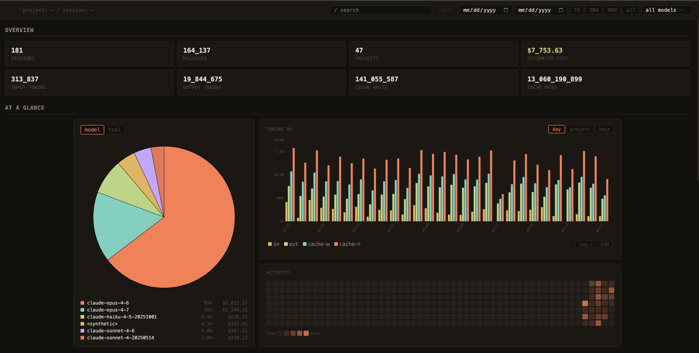
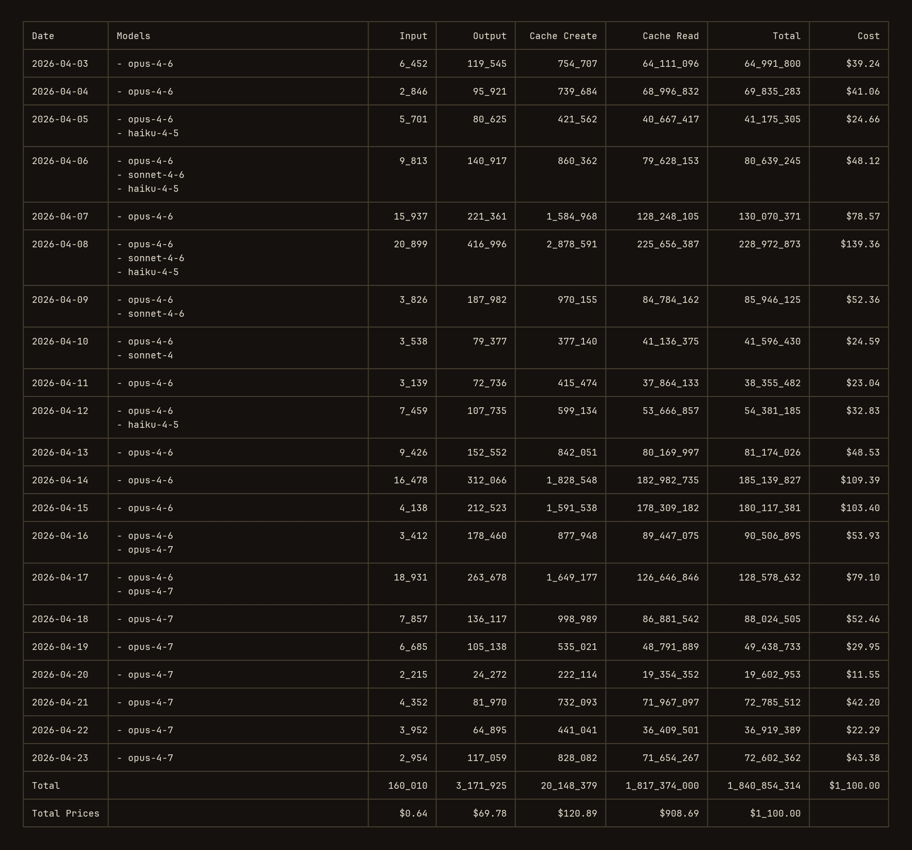

# ccaudit

Fast, local Claude Code log viewer. CLI, TUI, and static web — Rust binary, <1.3 MB.

<p align="center">
  
</p>

<p align="center">
  
</p>

```
ccaudit daily                         # token usage + cost, today and lately
ccaudit tui                           # interactive terminal browser
ccaudit web                           # generate + serve the web dashboard
ccaudit statusline                    # one-line summary for your shell prompt
```

## What it is

One Rust binary. CLI, TUI, and web for your `~/.claude` logs. Mmap'd cache, ~10 ms warm start.

Inspired by:

- [ccusage](https://github.com/ryoppippi/ccusage)
- [claude-code-log](https://github.com/daaain/claude-code-log)
- [claude-session-dashboard](https://github.com/dlupiak/claude-session-dashboard)

|                       | ccaudit                    | ccusage        | claude-code-log    | claude-session-dashboard |
| --------------------- | ------------------------ | -------------- | ------------------ | ------------------------ |
| Runtime               | Rust binary (~1.3 MB)    | Node.js        | Python             | Node.js + browser        |
| Indexing time         | ~10 ms (warm mmap cache) | ~12 s          | ~90 s              | on-demand per request    |
| CLI reports           | yes (daily/monthly/…)    | reference impl | —                  | —                        |
| TUI browser           | yes (`ccaudit tui`)        | —              | —                  | —                        |
| Web dashboard         | yes (`ccaudit web`)        | —              | HTML export        | yes (local server)       |
| Session detail viewer | yes                      | —              | yes                | yes                      |
| Install               | one binary / npm / cargo | npm            | `pip install` + py | `npx` / `npm install -g` |

`claude-session-dashboard` has one thing ccaudit doesn't: an **agent-delegation Gantt chart** for the sub-agent dispatch tree per session. Worth it if you run agentic workflows and want to see the delegation order.

## Install

Ephemeral (no install — runs the latest release once):

```bash
npx ccaudit              # Node / npm
bunx ccaudit             # Bun
uvx ccaudit              # uv / Astral
```

Permanent:

```bash
npm install -g ccaudit           # npm / yarn / pnpm
cargo install ccaudit            # cargo (from crates.io)
pipx install ccaudit             # pipx (Python)
uv tool install ccaudit          # uv tool

# from source
git clone https://github.com/electricapp/ccaudit && cd ccaudit
cargo install --path . --locked
```

All five package managers resolve to the same pre-built platform
binary — there's no Node or Python runtime involvement at execution
time, the Python/JS shims just locate and `exec` the binary.

## Quickstart

```bash
ccaudit                                        # daily report (default)
ccaudit blocks --cost-limit 100                # 5-hour billing windows w/ progress bar
ccaudit session --breakdown                    # per-session per-model cost
ccaudit web --port 8080                        # static site + local server
ccaudit tui                                    # interactive browser
```

All subcommands accept `--json` for machine-readable output.

## Features

- **Daily / monthly / session / blocks** reports, plus a compact `statusline` for shell prompts
- **TUI browser** — keyboard-driven navigation, fuzzy search, message viewer, dashboard (`d`), resume (`c`)
- **Web dashboard** — tables with sortable columns, pie/histogram/heatmap charts, full message viewer, URL routing (`/p/{slug}/s/{uuid}`)
- **Scope-aware**: press `d` from any view and the dashboard reflects just that project or session
- **Per-token-type cost breakdown** on hover
- **Accurate pricing** — fetches latest rates from LiteLLM on demand (`ccaudit refresh-prices`)
- **Carbon footer** (`--carbon`) — energy / CO₂ / tree-year estimate for the reported window
- **Deterministic filters** — `--since YYYYMMDD`, `--until`, `--project`, `--timezone`, `--locale`, `--source`
- **mmap'd cache** — repeated runs on the same `~/.claude/projects/` read from a memory-mapped schema, zero deserialization
- **Pluggable sources** — a `Source` trait (see `src/source/mod.rs`) abstracts log discovery, parsing, model pricing, and model normalization. Today only Claude Code is shipped; the trait is shaped to accept adapters for Codex, OpenCode, π / Pi, MCP servers, or any other agent that writes JSONL-shaped session logs. Pick a source with `--source NAME`.

## TUI keybindings

| key                | action                                    |
| ------------------ | ----------------------------------------- |
| `↑`/`↓` or `k`/`j` | move selection                            |
| `Enter` or `→`     | open                                      |
| `←` or `Esc`       | back                                      |
| `/`                | search                                    |
| `d`                | toggle dashboard (scoped to current view) |
| `c`                | `claude -r <id>` — resume this session    |
| `o`                | open the web view                         |
| `r`                | reset all filters / scope                 |
| `q`                | quit                                      |

## Web dashboard keys

| key             | action                           |
| --------------- | -------------------------------- |
| `d`             | toggle scoped dashboard          |
| `m` / `t`       | pie: by model / by tool          |
| `h` / `p` / `y` | histogram: hour / project / day  |
| `l`             | histogram log/linear scale       |
| `r`             | reset all filters / sort / scope |
| `j`/`k`         | row navigation                   |

## Subcommands

```
ccaudit daily           daily token usage + cost          (default)
ccaudit monthly         aggregate by month
ccaudit session         aggregate by conversation session
ccaudit blocks          5-hour billing windows, with active detection
ccaudit statusline      compact one-line summary (for terminal status bars)
ccaudit tui             interactive TUI browser
ccaudit web             generate static site + serve
ccaudit refresh-prices  fetch latest model prices from LiteLLM
ccaudit help [SUB]      show help for ccaudit or for a subcommand
```

Run `ccaudit <SUBCOMMAND> --help` for mode-specific flags.

## License

MIT. See [LICENSE](LICENSE).
